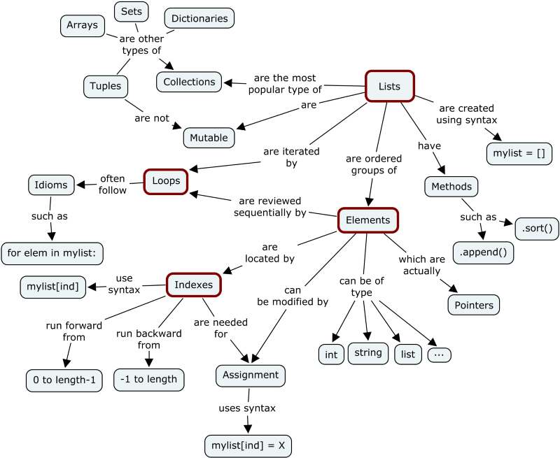
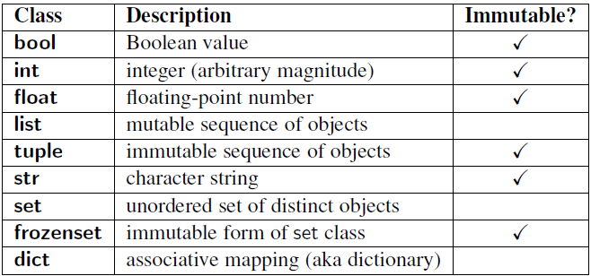

> 在Python里，一切皆对象，完全的面向对象，跟Java不一样，Java的基本数据类型并不是对象，比如int等，而在Python里面即便是内置的数据类型都是一个对象，虽然它们在命名的时候都是小写，所有的对象均可分为可变的和不可变的，本文翻译自[medium]((https://medium.com/@meghamohan/mutable-and-immutable-side-of-python-c2145cf72747))上面关于Python可变和不可变对象的一篇文章

Python中的所有东西都是一个对象。 Python的每个新手应该快速学到的是Python中的所有对象都可以是可变的或不可变的。



让我们深入了解它的细节...由于Python中的所有内容都是一个对象，每个变量都包含一个对象实例。每当初始化一个对象时，会为其分配唯一的对象ID。 它的类型在运行时定义好了，一旦设置完类型，就永远不会改变，但是如果它是可变的对象，它的状态就可以改变。 简单来说，可变对象在创建后可以更改，而不可变对象则不能。

> 内置类型的对象（int，float，bool，str，tuple，unicode）是不可变的。 像（list，set，dict）这样的内置类型的对象是可变的。 自定义类通常是可变的。 要模拟类中的不变性，应该覆盖属性设置和删除以引发异常。



现在问题是，我们如何确定我们的变量是可变的还是不可变的对象。 为此，我们应该了解'ID'和'TYPE'这2个方法的作用。

## ID and TYPE方法

内置函数id()以整数形式返回对象的标识。 此整数通常对应于对象在内存中的位置，尽管这特定于Python实现和正在使用的平台。 is运算符可以用来比较两个对象的标识。

内置函数type()返回对象的类型。让我们看一个简单的例子

```shell
''' Example 1 '''
>>> x = "Holberton"
>>> y = "Holberton"
>>> id(x)
140135852055856
>>> id(y)
140135852055856
>>> print(x is y) '''comparing the types'''
True
''' Example 2 '''
>>> a = 50
>>> type(a)
<class: ‘int’>
>>> b = "Holberton"
>>> type(b)
<class: 'string'>
```

我们现在已经看到如何比较两个简单的字符串变量来找出类型和id。使用这两个函数，我们可以检查不同类型的对象如何与变量关联以及如何更改对象。

## 可变和不可变对象

因此，正如我们之前讨论的，可变对象可以更改其状态或内容，而不可变对象则不能。

> Mutable objects:
>
> list, dict, set, byte array
>
> Immutable objects:
>
> int, float, complex, string, tuple, frozen set [note: immutable version of set], bytes

一个找出对象类型可变性的实际例子

```shell
x = 10
x = y
```

我们正在创建一个int类型的对象。标识符x和y指向同一个对象

```python
id(x) == id(y)
id(y) == id(10)
```

如果我们做一个简单的操作。

```python
x = x + 1
```

现在是

```python
id(x) != id(y)
id(x) != id(10)
```

标记x的对象已更改。对象10从未被修改过。不可变对象在创建后不允许修。

在可变对象的情况下

```python
m = list([1, 2, 3])
n = m
```

我们正在创建一个类型列表的对象。标识符m和m标记到同一个列表对象，它是3个不可变int对象的集合。

```python
id(m) == id(n)
```

现在从列表对象中弹出一个项目会改变对象，

```python
m.pop()
```

对象ID不会被更改

```python
id(m) == id(n)
```

修改后，m和n将指向相同的列表对象。列表对象现在将包含[1,2]。

那么到目前为止我们从上面的例子中看到了什么呢？

- Python以不同方式处理可变和不可变对象。
- 不可变对象比可变对象更快。
- 当您需要更改对象，示例列表，字典等大小时，可变对象很有用。当您需要确保所创建的对象始终保持不变时，将使用不可变对象。
- 不可变对象在“改变”方面基本上是昂贵的，因为这样做涉及创建副本。而改变可变对象很便宜。

## 不变性的例外

并非所有不可变对象实际上都是不可变的。困惑？让我解释。

如前所述，Python容器比如元组是不可变的。 这意味着元组的值在创建后无法更改。 但是元组的“值”实际上是一系列名称，它们与对象的绑定不可更改。 需要注意的关键是绑定是不可更改的，而不是它们绑定的对象不可更改。

让我们考虑一个元组t =（'holberton'，[1,2,3]）

上面的元组t包含不同数据类型的元素，第一个是不可变的字符串，第二个是可变列表。元组本身不可变。 即它没有任何改变其内容的方法。 同样，字符串是不可变的，因为字符串没有任何变异方法。 但是list对象确实有变异方法，因此可以更改。 这是一个微妙的观点，但仍然很重要：不可变对象的“值”不能改变，但它的组成对象可以。

## 如何将对象传递给函数

对于我们来说，了解可变类型和不可变类型之间的区别以及在传递给函数时如何处理它们非常重要。当使用适当的对象时，内存效率会受到很大影响。

例如，如果在函数中通过引用调用可变对象，则它可以更改原始变量本身。 因此，为避免这种情况，需要将原始变量复制到另一个变量。 可以通过引用调用不可变对象，因为它的值无论如何都不能更改。

```python
def updateList(list1):
    list1 += [10]
n = [5, 6]
print(id(n))                  # 140312184155336
updateList(n)
print(n)                      # [5, 6, 10]
print(id(n))                  # 140312184155336
```

从上面的例子可以看出，我们通过引用调用来调用列表，因此对原始列表本身也进行了更改。

让我们看看另一个例子：

```python
def updateNumber(n):
    print(id(n))
    n += 10
b = 5
print(id(b))                   # 10055680
updateNumber(b)                # 10055680
print(b)                       # 5
```

在上面的示例中，相同的对象被传递给函数，但即使对象相同，变量值也不会更改。 这称为按值传递。 那么到底发生了什么？ 当函数调用该值时，仅传递变量的值，而不传递对象本身。 因此，引用对象的变量不会更改，但对象本身正在更改，但仅在函数范围内。 因此，这一变化没有得到反映。
