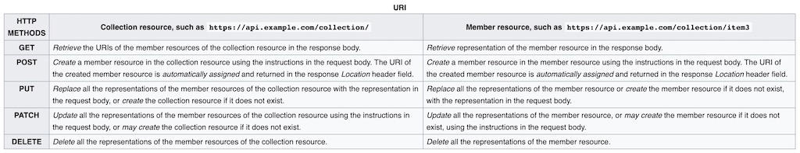

> 本文主要是介绍用 flask 实现 rest 风格的 web api

# REST

Representational state transfer (REST) 是定义了一系列约束用来构建 [web service](https://en.wikipedia.org/wiki/Web_service) 的一种软件架构风格 (引用自 [wikipedia](https://en.wikipedia.org/wiki/Representational_state_transfer) 上对 rest 的定义)，这个定义是站在整个软件工程领域的角度去定义的，而在日常开发中，rest 风格的 `web api` 设计常常被应用到我们的项目当中，它的风格设计很适合用于后台接口开发，开放平台接口开发等，因为大家几乎对 rest 的定义的约束（或者称为协议）都有所了解，它主要的特点就是：

- 利用 [http method](https://www.w3.org/Protocols/rfc2616/rfc2616-sec9.html) 定义接口行为，便于理解接口行为。
- 接口的行为与后端流行数据存储的[关系型数据库](https://en.wikipedia.org/wiki/Relational_database#RDBMS)增删改查相对应，满足大部分接口需求场景。

一个系统的接口，代表着这个系统能够提供的功能，要想了解一个系统功能，就可以从它提供的接口了解，而接口的表达能力的强弱，就代表这个系统的功能表达能力，而 rest 风格的接口设计，也正是因为它的表达能力，满足大部分的需求场景，而被大家所熟知，它被主要的应用的业务需求场景：

- 产品后台数据接口
- 开放平台数据接口

而它的局限也是很明显，从它定义的约束，就可以看出，它更适合用来开发资源型接口，但是假如你提供的接口是 `action` 类接口，它只是一个触发接口，并没有涉及到资源的处理，或者它可能涉及到不同资源的处理，这时候它就不满足你的需求了，对于这类接口，其实并不一定要在 rest 的框框里面实现，不要尝试去破坏 rest 的设计，而是单独实现，作为 rest 的补充和扩展，来满足你的需求。

如果要用 python 实现一个 rest 风格的接口应该怎么做呢？首先我们应该想到需要用 python 流行的网关协议 [wsgi](https://en.wikipedia.org/wiki/Web_Server_Gateway_Interface) 去处理网络请求，然后根据 rest 定义的约束用接口来实现，而 [Flask](https://flask.palletsprojects.com/en/1.1.x/)  作为实现了 wsgi 协议的流行框架，自然而然就成了一个好的选择。

# Flask Rest API 实现

我们先看下 rest 定义的约束：



其中 `PATCH` 方法可以不用实现，因为它跟 `PUT` 实现的功能有重叠，也就是说我们的接口要实现 `GET`, `POST`, `PUT`, `DELETE` 方法定义的功能，而 flask view 模块就提供了 [MethodView](https://flask.palletsprojects.com/en/1.1.x/views/#method-views-for-apis)，我们可以基于 MethodView 实现 API 层 rest 定义的约束：

```python
from flask import Flask
from flask.views import MethodView

class ResourceView(MethodView):
    path = ''

    def get(self, id):
        raise NotImplementedError

    def post(self):
        raise NotImplementedError

    def put(self, id):
        raise NotImplementedError

    def delete(self, id):
        raise NotImplementedError
```

如 flask 文档里面提到的，还需要一个方法去注册路由：

```python
def register_restapi(app: Flask):
    view_func = ResourceView.as_view(Resource.__name__)
    view_path = ResourceView.path
    app.add_url_rule(
        view_path,
        defaults={'id': None},
        view_func=view_func,
        methods=['GET'])
    app.add_url_rule(
        view_path,
        view_func=view_func,
        methods=['POST'])
    app.add_url_rule(
        view_path + '/<int:id>',
        view_func=view_func,
        methods=['GET', 'DELETE', 'PUT'])
```

`ResourceView` 只是定义了一些抽象方法，我们现在讨论下实现，rest 定义的接口是对一个资源进行操作，所以我们需要定义一个 `Resource` 模型， 并且它应该具有约束中要求的功能实现:

```python
from typing import List


class Resource(object):

    def to_dict(self) -> dict:
        raise NotImplementedError

    @classmethod
    def get_by_id(cls, id):
        raise NotImplementedError

    @classmethod
    def get(cls, *query, **filters):
        raise NotImplementedError

    @classmethod
    def add(cls, instance: dict):
        raise NotImplementedError

    @classmethod
    def batch_add(cls, instances: List[dict]):
        raise NotImplementedError

    @classmethod
    def update(cls, instance: dict, **filters):
        raise NotImplementedError

    @classmethod
    def update_by_id(cls, id, instance: dict):
        raise NotImplementedError

    @classmethod
    def batch_update(cls, instances: List[dict]):
        raise NotImplementedError

    @classmethod
    def delete(cls, instance):
        raise NotImplementedError

    @classmethod
    def delete_by_id(cls, id):
        raise NotImplementedError

    @classmethod
    def batch_delete(cls, instances: List[dict]):
        raise NotImplementedError
```

其中 `to_dict` 方法是 `Resource` 序列化成 json 需要用到的，因为 rest api 默认使用的网络通信协议是 `http-json`，有了 `Resource` 模型之后，我们可以这样实现 `ResourceView`:

```python
from werkzeug.exceptions import BadRequest, NotFound
from flask import (Flask, request, jsonify)
from flask.views import MethodView


class ResourceView(MethodView):

    def __init__(self, resource: Resource):
        self.resource = resource

    def get(self, id):
        if id is not None:
            instance = self.resource.get_by_id(id)
            if not instance:
                raise NotFound
            res = instance.to_dict()
        else:
            instances = self.resource.get_by_fliters(**request.args)
            res = [instance.to_dict() for instance in instances]
        return jsonify(res)

    def post(self):
        request_body = request.get_json()
        if isinstance[request_body, list]:
            instances = self.resource.batch_add(request_body)
            res = [instance.to_dict() for instance in instances]
        elif isinstance[request_body, dict]:
            instance = self.resource.add(request_body)
            res = instance.to_dict()
        else:
            raise BadRequest
        return jsonify(res), 201

    def put(self, id):
        request_body = request.get_json()
        if id is not None:
            if not isinstance(request_body, dict):
                raise BadRequest
            instance = self.resource.update_by_id(id, request_body)
            if not instance:
                raise NotFound
            res = instance.to_dict()
        elif isinstance(request_body, dict):
            instance = self.resource.update(request_body)
            res = instance.to_dict()
        elif isinstance(request_body, list):
            instances = self.resource.batch_update(request_body)
            res = [instance.to_dict() for instance in instances]
        else:
            raise BadRequest
        return jsonify(res)

    def delete(self, id):
        request_body = request.get_json()
        if id is not None:
            instance = self.resource.get_by_id(id)
            if not instance:
                raise NotFound
            self.resource.delete(instance)
        elif isinstance(request_body, dict):
            self.resource.delete(request_body)
        elif isinstance(request_body, list):
            self.resource.batch_delete(request_body)
        else:
            raise BadRequest
        return '', 204
```

至于 `Resource` 的实现，因为涉及到使用不同的 `orm`，所以会有不同的实现方式，而 `Resource` 只是定义了 rest 的约束，具体实现可以根据自己项目使用的 `orm` 实现，这里举 [peewee orm](http://docs.peewee-orm.com/en/latest/) 这个例子：

```python
from typing import List

from peewee import Model
from playhouse.shortcuts import model_to_dict


class PeeweeResource(Resource, Model):

    def to_dict(self):
        return model_to_dict(self)

    @classmethod
    def get_by_id(cls, id):
        return Model.get_by_id(id)

    @classmethod
    def get_by_fliters(cls, **filters):
        return Model.get(**filters)

    @classmethod
    def add(cls, instance):
        return Model.create(**instance)

    @classmethod
    def batch_add(cls, instances: List[dict]):
        return Model.bulk_create(instances)

    @classmethod
    def update(cls, instance: dict, **filters):
        instances = Model.get(**filters)
        for ins in instances:
            Model.update(**instance).where(cls.id == ins.id).execute()
        return Model.get(**filters)

    @classmethod
    def update_by_id(cls, id, instance: dict):
        Model.update(**instance).where(cls.id == id).execute()
        return Model.get_by_id(id)

    @classmethod
    def delete(cls, instance):
        pk = instance.get('id')
        if not pk:
            raise Exception('pk not found')
        return Model.delete_by_id(pk)

    @classmethod
    def batch_delete(cls, instances: List[dict]):
        for instance in instances:
            pk = instance.get('id')
            if not pk:
                raise Exception('pk not found')
            Model.delete_by_id(pk)
```

这样看起来只需要实现 `Resource`， 就可以开出 rest api，这时候可以这样做：

```python
def get_all_resource_views():
    import gc
    resources = [
        kls for kls in gc.get_objects()
        if issubclass(type(kls), type) and issubclass(kls, Resource)
        and kls != Resource and 'Resource' not in kls.__name__
    ]
    resource_views = {}
    for resource in resources:
        resource_name = resource.__name__.lower()
        resource_view = ResourceView.as_view('{}_api'.format(resource_name), resource)
        resource_views['/{}s'.format(resource_name)] = resource_view
    return resource_views
```

然后需要修改下 `register_restapi` 方法：

```python
def register_restapi(app: Flask):
    resource_views = get_all_resource_views()
    for path, view_func in resource_views.items():
        app.add_url_rule(
            path,
            defaults={'id': None},
            view_func=view_func,
            methods=['GET'])
        app.add_url_rule(
            path,
            view_func=view_func,
            methods=['POST'])
        app.add_url_rule(
            path + '/<int:id>',
            view_func=view_func,
            methods=['GET', 'DELETE', 'PUT'])
```

这样，在 flask 实例化的时候调用这个方法注册一遍路由即可实现将所有的 `Resource` 实现restapi 接口。

# 总结

从上面可以看出，rest api 的设计，需要2个模型：

- `Resource`，需要通过 rest api 暴露出去的资源（可以是数据、缓存、开关等），并实现 rest 约束需要的接口。
- `ResourceView`，在 http 网关协议层根据 http method 处理 http 请求，实现 rest 定义的约束。

至于在 http 网关协议层用什么 web framework 去处理 http 请求，可以根据自己的项目实际使用到的 web framework 去实现，这样就可以对外暴露出 rest api（或者称为 web service），给外部系统或者端调用，本文作为 flask 实战，自然而然选择了 flask 举例。

# 参考

- [Wikipedia Rest](https://en.wikipedia.org/wiki/Representational_state_transfer)
- [Http RFC 2616](https://www.w3.org/Protocols/rfc2616/rfc2616-sec9.html)
- [Relation Database](https://en.wikipedia.org/wiki/Relational_database#RDBMS)
- [Flask MethodView](https://flask.palletsprojects.com/en/1.1.x/views/#method-views-for-apis)
- [peewee orm](http://docs.peewee-orm.com/en/latest/)
