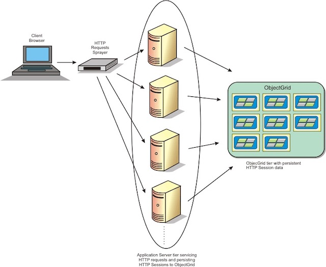

> 本文是讲述 [flask](https://flask.palletsprojects.com/en/1.1.x/) 的 session 实现以及 session 的原理



# Http Session

[Http](https://en.wikipedia.org/wiki/Hypertext_Transfer_Protocol) 协议被广泛的用于 B/S or C/S 结构中端跟服务器之间通信，众所周知 `Http` 是一种[无状态协议](https://en.wikipedia.org/wiki/Stateless_protocol)，当用户通过客户端/浏览器调用服务端接口登录后，用户再次调用服务端接口时，这2个请求是隔离的（isolated），这时候为了避免要求重复登录并保持会话，但是请求又保持独立，就需要存储用户鉴权信息在客户端/浏览器端，这就有了 [Session](https://en.wikipedia.org/wiki/Session_(computer_science)) ，一般 session 会存储在 [http cookie](https://en.wikipedia.org/wiki/HTTP_cookie) 里面，而 cookie 本身设计就是为了存储一些有状态的信息，它会跟域名绑定并保留在 http client 中，后续用户的每次请求都会带上，所以通常 session 的实现就是在用户第一次调登录接口后，由后端设置在 response 的 cookie 里面，随着 response 的返回而设置进端的 cookie 里面，后续所有的请求服务端均会通过 cookie 里面的 session 去做用户的鉴权，而 session 的 cookie 名称以及值，可以自定义，一般这个值是通过一个签名算法加密的，服务端只要进行反签就可以拿到签名之前存储在 session 的用户信息，根据这个用户信息做鉴权。

# Flask Session

[Flask Sessions](https://flask.palletsprojects.com/en/1.1.x/quickstart/#sessions) 模块的功能就是为了实现 http session，从 `flask.sessions` 的源代码可以看到在 `SecureCookieSessionInterface` 通过 [itsdangerous](https://itsdangerous.palletsprojects.com/en/1.1.x/) 对 session 进行了签名(`save_session`)和反签(`open_session`)，当一个 request 进来之后，cookie 里面如果有 session，就会调用反签的功能，拿到用户信息后存储在 session（这是一个存储在 thread local 里面的一个 dict） 里面，而你的应用可以从这个全局 session 拿到之前登录的时候存储在 sesson 的用户信息，具体实现可以参考 flask 文档里面给的例子。

# 单独实现 session 管理功能

Flask Sessions 的好处在于，session 不必存储在服务端，而是在程序运行时实现添加和验证，这可以满足大部分对 session 的需求，但是当你有下面的需求时：

- 需要知道目前有多少个 session 在打开
- 需要知道某个用户有多少个 session 在打开
- 需要知道某个用户是什么时候登录的（当然这个也可以通过日志查看）
- 不允许多点登录，只允许单点登录
- 踢掉一个指定的 session
- session 需要单独成为一个服务或者提供接口供其它服务鉴权（也可以说是拿到用户信息）

这时候就发现 Flask 自带的 Sessions 实现无法满足你的需求，当需要满足上面的需求时，session 就不得不存储在服务端，如果存储在服务端，那就只需要用到 cookie 的存储功能，而 cookie 的失效日期可以设置称一个固定的时间，比如：一年的有效时间 = 当前时间 + 365 天，同时你需要考虑：

- session 要存储哪些数据，也就是 session 实体模型是什么
- session 怎么存储，存储在关系型数据库里面，还是 k/v 数据库里面，还是对象存储

很显然需要满足上面的需求，最合适的还是存储在关系型数据库里面，而 session 的实体模型可以这样设计：


代码：

```python
class UserSession(object):
    user_id # 用户表的primary key 或者 unique key
    session_id # 经过签名加密的 session 值
    is_valid # 逻辑删除字段
    created_at # 创建时间
    updated_at # 更改时间
```

这样的模型设计即可满足以上所有需求：

- 通过查询 `UserSession` 中 `is_valid = True` 的记录数即可知道有多少 session
- 通过根据用户的 `user_id` 查询 `UserSession` 当中这个用户的记录数即可知道固定用户的 session
- 通过查询用户固定的 `session_id` 记录的 `created_at` 知道这个用户是什么时候登录的
- 如果需要支持单点登录，只需要当用户登录时，即创建 UserSession 时，把该用户其它的 UserSession 更改成 `is_valid = False`，这样当其它端通过无效的 session 请求时，会被要求重新登录
- 踢掉一个用户的一个 session，就是把那条记录更改成 `is_valid = False`
- 本身在存储上面就单独存储，就可以通过解藕出用户服务提供 session 功能

而接下来就要考虑 `session_id` 值怎么生成，这个值就是用来鉴权的，可以不用跟 flask sessions 里面实现的一样，正常的签名即可，比如：

```python
import hashlib
session_id = hashlib.md5('{secret_key}{username}{timestamp}{secret_key}'.format(secrey_key='', username='', timestamp='').encode('utf-8')) # username 需要在 user model 里面是唯一的
```

这样 `UserSession` 模型可以这样实现，这里用 [peewee orm](http://docs.peewee-orm.com/en/latest/) 举例：

```python
import hashlib
from datetime import datetime

from peewee import *
from playhoues.signals import pre_save, Model

class User(Model):
    username = CharField(null=False, default='', unique=True)
    password = CharField(null=False, default='')

    def to_dict(self):
        pass # 可根据具体需求实现

class UserSession(Model):
    user_id = IntegerField(null=False, default=0)
    session_id = CharField(null=False, default='', unique=True)
    is_valid = BooleanField(null=False, default=True)
    created_at = DateTimeField(null=False, default=datetime.now)
    updated_at = DateTimeField(null=False, default=datetime.now)

@pre_save(sender=UserSession)
def on_pre_save_user_session(model_class, instance: UserSession, created):
    if not instance.user_id:
        raise Exception('user_id is required')
    user = User.get_by_id(instance.user_id)
    if not user:
        raise Exception('user not found')
    if not instance.session_id:
        instance.session_id = hashlib.md5('{secret_key}{username}{timestamp}{secret_key}'.format(secrey_key='', username=user.username, timestamp=int(datetime.now().timestamp())).encode('utf-8'))
    return instance
```

web api 层可以这样实现：

```python
from werkzeug.exceptions import BadRequest, Unauthorized
from flask import (Flask, session, request, jsonify)

app = Flask(__name__)
app.secret_key = '' # 可以参考 flask 文档生成，一般从配置中读


@app.route('/login', methods=['POST'])
def login():
    user = user_login(**request.get_json()) # 具体实现代码就不写了
    user_session = UserSession.create(username=user.username)
    response = jsonify(user.to_dict())
    response.set_cookie('session_id', user_session.session_id)
    return response


@app.route('/logout', methods=['GET'])
def logout():
    session_id = request.cookies.get('session_id')
    if not session_id:
        raise Unauthorized
    invalid_user_session(session_id) # 具体实现也不写了
    return '', 204


# 在 before_request 这里做一个鉴权
@app.before_request
def before_request():
    session_id = request.cookies.get('session_id')
    if not session_id:
        raise Unauthorized
    user = get_user_by_session_id(session_id) # 具体实现也不写了
    if not user:
        raise Unauthorized
    # 鉴权完后可以把 user 存储在 flask session 或 g 中，方便在其它地方使用
    session['user'] = user.to_dict()
```

对于过期的 session，可以通过一个定时任务去做清理。

# 参考

- [http](https://en.wikipedia.org/wiki/Hypertext_Transfer_Protocol)
- [session](https://en.wikipedia.org/wiki/Session_(computer_science))
- [Flask Sessions](https://flask.palletsprojects.com/en/1.1.x/quickstart/#sessions)
- [peewee orm](http://docs.peewee-orm.com/en/latest/)
