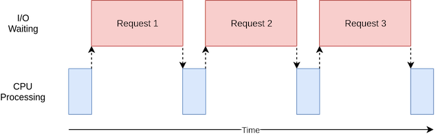
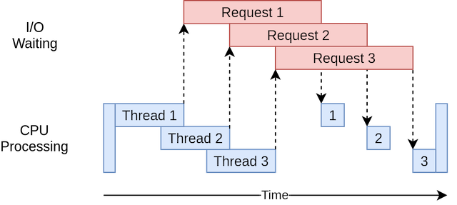
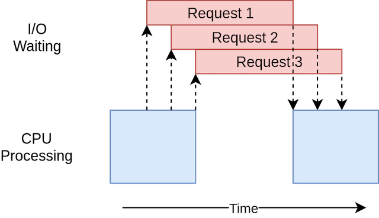
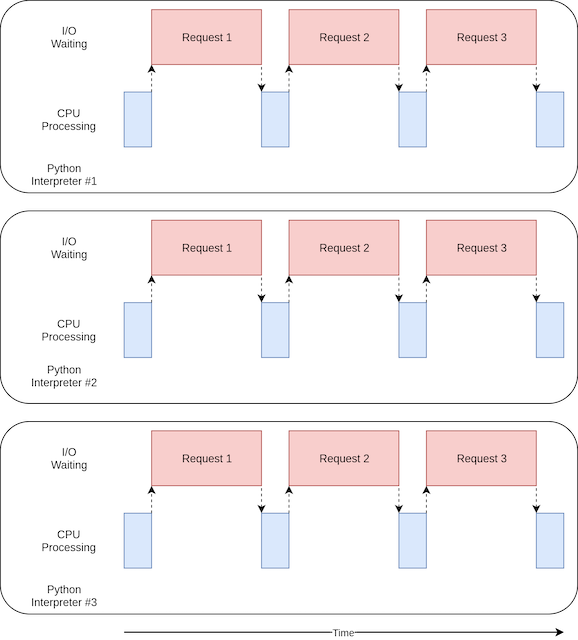
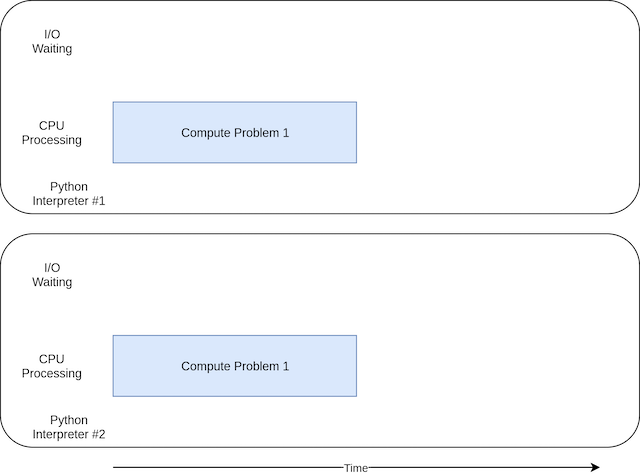

# 通过并发加速你的 python 程序


> 本文翻译至 `realpython` 上题为 [Speed Up Your Python Program With Concurrency](https://realpython.com/python-concurrency/) 的教程，教程对怎么利用并发加速 python 程序分析非常全面到位。

## 什么是并发（concurrency）？

从字典定义上讲，并发（concurrency）就是同时发生，在 python 语言里面，这些同时发生的事物被不同命名（thread、task、process），但是站在一个高层级（high level）上看，他们都指的是一系列按照顺序执行的指令。

我喜欢将它们视为不同的思路，每一条思路可以在某个特定的点上停止下来，执行他们的 CPU 或大脑可以切换到不同的思路上面，每个思路的状态（state）都会被保存，以至于它被打断后还可以正确的重新启动。

你可能很好奇为什么在 python 领域用不同的词汇来阐述相同的概念，事实证明在一个高层级（high level）上面思考，他们（thread, task, process）是一样的。一旦你开始往细节深处挖掘，它们都代表略有不同的事物。通过这些示例，您将了解更多有关它们的区别。

现在，让我们谈谈该定义的同时。 您必须谨慎一些，因为当您深入细节时，就会知道实际上只有 `multiprocessing` 是在同一时间运行这些思路。 `threading` 和 `asyncio` 都是在单个处理器上运行，因此一次只能运行一个。 他们只是巧妙地找到了轮流加快总体流程的方法。 即使他们不会同时运行不同的思路，我们仍然称其为并发（concurrency）。

线程或任务轮流运行的方式是 `threading` 和 `asyncio` 之间的最大区别。 在线程中，操作系统实际上了解每个线程，并可以随时中断它以开始运行其他线程。 这被称为[抢先式多任务处理](https://en.wikipedia.org/wiki/Preemption_%28computing%29#Preemptive_multitasking)，因为操作系统可以抢占您的线程以进行切换。

抢先式多任务处理非常方便，因为线程中的代码不需要执行任何操作即可进行切换。 由于存在“随时”一词，这也可能很困难。 此切换可能发生在单个 Python 语句的中间，甚至是 `x = x + 1` 之类的琐碎语句。

另一方面，`asyncio` 使用[协作式多任务处理](https://en.wikipedia.org/wiki/Cooperative_multitasking)。 这些任务必须通过宣布何时准备好退出来进行协作。 这意味着任务中的代码必须稍作更改才能实现。

预先进行此额外工作的好处是，您始终知道任务将在哪里调出。 除非标记了该语句，否则它不会在 Python 语句中间交换出来。 稍后您将看到这如何简化设计的各个部分。

## 什么是并行（Parallelism）?

到目前为止，您已经研究了在单个处理器上发生的并发。酷炫的新笔记本电脑拥有的所有这些 CPU 核心如何？您如何利用它们？ `multiprocessing` 就是答案。

通过 `multiprocessing`，Python 创建了新的进程。一个进程可以视为几乎完全不同的程序，尽管从技术上讲，它们通常被定义为资源的集合，其中资源包括内存，文件句柄等。考虑它的一种方法是，每个进程都在自己的 Python 解释器中运行。

由于它们是不同的进程，因此 `multiprocessing` 程序中的每个思路都可以在不同的核心上运行。在不同的内核上运行意味着它们实际上可以同时运行，这真是太好了。这样做会带来一些复杂性，但是 Python 在大多数情况下都可以很好地平滑它们。

现在您已经了解了 `concurrency` 和 `Parallelism` 是什么，让我们回顾一下它们之间的差异，然后我们来看一下它们为何有用的原因：

| 并发类型                  | 切换策略                               | 进程数 |
|---------------------------|----------------------------------------|--------|
| 抢先式多任务（threading） | 操作系统决定何时切换Python外部的任务。 | 1      |
| 协作式多任务（asyncio）   | 这些任务自己决定何时放弃控制权。       | 1      |
| 多进程（Multiprocessing） | 所有进程都在不同的处理器上同时运行。   | 许多   |

## 什么时候并发有用

并发可以对两种类型的问题产生很大的影响，这些通常称为:

- CPU 约束
- I/O 约束

受 I/O 约束的问题会导致程序运行缓慢，因为它经常必须等待某些外部资源的输入/输出（I/O）。 当您的程序使用比 CPU 慢得多的东西时，它们经常出现。

比 CPU 慢的例子很多，但值得庆幸的是，您的程序并未与其中大多数交互。 程序最常与之交互的较慢事物是文件系统（file system）和网络连接（network connections）。

让我们看看它是什么样的：



在上图中，蓝色框显示了程序执行工作的时间，红色框是等待 I/O 操作完成所花费的时间。 该图未按比例绘制，因为 Internet 上的请求可能比 CPU 指令花费几个数量级，因此您的程序最终可能会花费大部分时间等待。 这是您的浏览器大部分时间都在执行的操作。

另一方面，有些程序类可以进行大量计算，而无需与网络交谈或访问文件。 这些是与 CPU 约束的程序，因为限制程序速度的资源是 CPU，而不是网络或文件系统。

这就是 CPU 约束程序的对应图：


在阅读下一节中的示例时，您会发现不同形式的并发在受 CPU 约束和受 I/O 约束的程序中表现更好或更差。 在您的程序中增加并发性会增加代码和复杂性，因此您需要确定潜在的速度提升是否值得付出额外的努力。 在本文末尾，您应该有足够的信息来开始做出此决定。

以下是简要说明，以阐明这一概念：

| I/O-Bound Process                                                                    | CPU-Bound Process                                  |
|--------------------------------------------------------------------------------------|----------------------------------------------------|
| 您的程序大部分时间都在与速度较慢的设备（例如网络连接，硬盘驱动器或打印机）进行通信。 | 您的程序大部分时间都花在CPU操作上。                |
| 加快速度需要等待这些设备的时间重叠。                                                 | 加快速度需要找到在相同的时间内进行更多计算的方法。 |

接下来您将首先看到 I/O 约束程序。然后您将看到一些处理与 CPU 约束的程序的代码。

## 怎么加速一个 I/O 约束的程序

让我们从关注 I/O 约束程序和一个常见问题开始：通过网络下载内容。 对于我们的示例，您将从几个站点下载网页，但实际上可能是任何网络流量。 可视化和设置网页更加容易。

### Synchronous 版本

我们将从该任务的非并行版本开始。 请注意，此程序需要 [requests](http://docs.python-requests.org/en/master/) 模块。 您应该在运行它之前用 pip 安装好 requests 模块，可以使用 [virtualenv](https://realpython.com/python-virtual-environments-a-primer/)。 此版本完全不使用并发：

```python
import requests
import time


def download_site(url, session):
    with session.get(url) as response:
        print(f"Read {len(response.content)} from {url}")


def download_all_sites(sites):
    with requests.Session() as session:
        for url in sites:
            download_site(url, session)


if __name__ == "__main__":
    sites = [
        "https://www.jython.org",
        "http://olympus.realpython.org/dice",
    ] * 80
    start_time = time.time()
    download_all_sites(sites)
    duration = time.time() - start_time
    print(f"Downloaded {len(sites)} in {duration} seconds")
```

如您所见，这是一个相当短的程序。 `download_site()` 只是从 `URL` 下载内容并打印大小。 需要指出的一点是，我们正在使用来自 requests 的 `Session` 对象。

可以直接从请求中简单地使用 `get()`，但是创建 `Session` 对象可以使请求做一些花哨的网络技巧并真正加快速度。

`download_all_sites()` 创建会话，然后浏览站点列表，依次下载每个站点。 最后，它打印出此过程花费了多长时间，因此您可以在以下示例中看到并发对我们的帮助，这使您感到满意。

该程序的处理图与上一节中的 I/O 约束图非常相似。

> **_注意:_** 网络流量取决于许多因素，这些因素可能会每秒变化。 我已经看到由于网络问题，这些测试的次数从一次运行到另一次运行翻了一番。

#### 同步版本优点

这个版本的代码最棒的是: 很容易。 编写和调试相对容易。 考虑起来也更加简单明了。 贯穿其中只有一条思路，因此您可以预测下一步是什么以及其行为方式。

#### 同步版本存在的问题

这里最大的问题是，与我们将提供的其他解决方案相比，它相对较慢。这是最终输出在我的计算机上给出的示例：

```shell script
$ ./io_non_concurrent.py
   [most output skipped]
Downloaded 160 in 14.289619207382202 seconds
```

> **_注意:_** 您的结果可能会有很大差异。 运行此脚本时，我看到时间从14.2秒到21.9秒不等。 在本文中，我以最快的速度运行了三个时间。 两种方法之间的差异仍然很明显。

但是，变慢并不总是一个大问题。 如果您正在运行的程序使用同步版本仅需2秒钟，而很少运行，则可能不值得增加并发性。 你可以在这里停下来。

如果您的程序经常运行该怎么办？ 如果要花几个小时运行怎么办？ 让我们继续进行并发，方法是使用线程重写此程序。

### threading 版本

您可能已经猜到了，编写线程程序会花费更多的精力。 但是，对于简单的案例，您花费很少的额外精力可能会感到惊讶。 这是带有线程的相同程序的外观：

```python
import concurrent.futures
import requests
import threading
import time


thread_local = threading.local()


def get_session():
    if not hasattr(thread_local, "session"):
        thread_local.session = requests.Session()
    return thread_local.session


def download_site(url):
    session = get_session()
    with session.get(url) as response:
        print(f"Read {len(response.content)} from {url}")


def download_all_sites(sites):
    with concurrent.futures.ThreadPoolExecutor(max_workers=5) as executor:
        executor.map(download_site, sites)


if __name__ == "__main__":
    sites = [
        "https://www.jython.org",
        "http://olympus.realpython.org/dice",
    ] * 80
    start_time = time.time()
    download_all_sites(sites)
    duration = time.time() - start_time
    print(f"Downloaded {len(sites)} in {duration} seconds")
```

添加线程时，整体结构相同，只需要进行一些更改。 `download_all_sites()` 从每个站点调用一次功能更改为更复杂的结构。

在此版本中，您正在创建 `ThreadPoolExecutor`，这似乎很复杂。让我们来分解一下：`ThreadPoolExecutor` = 线程 + 池 + 执行器。

您已经了解线程部分。那只是我们前面提到的思路。池部分开始变得有趣。该对象将创建一个线程池，每个线程可以同时运行。最后，执行程序是控制池中每个线程运行方式和时间的部分。它将在池中执行请求。

很有帮助的是，标准库将 `ThreadPoolExecutor` 实现为上下文管理器，因此您可以使用 `with` 语法管理创建和释放线程池。

一旦有了 `ThreadPoolExecutor`，就可以使用它的便捷 `.map()` 方法。此方法在列表中的每个站点上运行传递的功能。最重要的是，它使用正在管理的线程池自动并发运行它们。

那些来自其他语言甚至 `Python 2` 的人可能想知道普通对象和函数在哪里，这些对象和函数管理着处理线程时所习惯的细节，例如 `Thread.start()`，`Thread.join()` 和队列。

这些都仍然存在，您可以使用它们来实现对线程运行方式的细粒度控制。但是，从 `Python 3.2` 开始，标准库添加了一个称为 `Executors` 的更高级别的抽象，如果您不需要细粒度的控件，则可以为您管理许多细节。

我们的示例中另一个有趣的变化是，每个线程都需要创建自己的 `request.Session()` 对象。当您查看有关请求的文档时，说起来不一定容易，但是阅读此问题后，很显然，每个线程都需要一个单独的 `Session`。

这是线程有趣和棘手的问题之一。因为操作系统控制着您的任务何时被中断以及另一个任务的启动时间，所​​以线程之间共享的任何数据都需要受到保护，或者是线程安全的。不幸的是，`requests.Session()` 不是线程安全的。

根据数据是什么以及如何使用数据，有几种使数据访问线程安全的策略。其中之一是使用线程安全的数据结构，例如 `Python` 队列模块中的 `Queue`。

这些对象使用诸如 `threading.Lock` 之类的低级原语，以确保只有一个线程可以同时访问一段代码或一部分内存。您正在通过 `ThreadPoolExecutor` 对象间接使用此策略。

这里使用的另一种策略是称为线程本地存储。 `Threading.local()` 创建一个看起来像全局对象的对象，但该对象特定于每个单独的线程。在您的示例中，这是通过 `threadLocal` 和 `get_session()` 完​​成的：

```python
threadLocal = threading.local()


def get_session():
    if not hasattr(threadLocal, "session"):
        threadLocal.session = requests.Session()
    return threadLocal.session
```

`ThreadLocal` 在线程模块中专门用于解决此问题。看起来有些奇怪，但是您只想创建这些对象之一，而不是为每个线程创建一个。对象本身负责将来自不同线程的访问分离到不同的数据。

调用 `get_session()` 时，它查找的会话是特定于其正在运行的特定线程的。因此，每个线程在首次调用 `get_session()` 时都会创建一个会话，然后在整个生命周期中仅在随后的每次调用中使用该会话。

最后，简要介绍一下选择线程数的方法。您可以看到示例代码使用 5 个线程。随意使用此数字，看看整体时间如何变化。您可能希望每次下载只有一个线程是最快的，但至少在我的系统上不是。我发现最快的结果在 5 到 10 个线程之间。如果您的要求更高，那么创建和销毁线程的额外开销将消除任何时间节省。

此处的难题是，正确的线程数并不是一项任务到另一项任务的常数。需要一些实验。

#### 线程版本的优点

它很快！这是我测试的最快速度。请记住，非并行版本花费了超过14秒的时间：

```shell script
$ ./io_threading.py
   [most output skipped]
Downloaded 160 in 3.7238826751708984 seconds
```

它的执行时序图如下所示：



它使用多个线程来同时向网站发出多个打开的请求，从而使您的程序可以重叠等待时间并更快地获得最终结果！ 对的！那是目标。

#### 线程版本的问题

然而，正如您从示例中看到的那样，这需要花费更多的代码才能实现，并且您实际上必须考虑一下线程之间共享的数据。

线程可以以微妙且难以检测的方式进行交互。 这些相互作用会导致竞态条件，从而经常导致随机，间歇性的错误，这些错误很难发现。 那些不熟悉比赛条件概念的人可能想扩大阅读下面的部分。

> **_注意:_** 扩展部分未翻译

### asyncio 版本

在深入研究 `asyncio` 示例代码之前，让我们先详细介绍一下 `asyncio` 的工作原理。

#### asyncio 基础

这将是 `asyncio` 的简化版本。这里掩盖了许多细节，但仍然传达了其工作原理的想法。

`asyncio` 的一般概念是单个 `Python` 对象（称为事件循环）控制每个任务的运行方式和时间。事件循环知道每个任务并知道其处于什么状态。实际上，任务可以处于许多状态，但现在让我们想象一个简化的事件循环，其中只有两个状态。

就绪状态将指示任务有工作要做并且已准备好运行，而等待状态意味着任务正在等待某些外部事物完成，例如网络操作。

简化的事件循环维护两个任务列表，每个状态一个列表。它选择一个就绪任务，然后将其重新启动运行。该任务处于完全控制状态，直到它协同将控制权移交给事件循环为止。

当正在运行的任务将控制权交还给事件循环时，事件循环将该任务放入就绪列表或等待列表中，然后遍历等待列表中的每个任务以查看其是否已通过 I/O 操作准备就绪完成。它知道就绪列表中的任务仍处于就绪状态，因为它知道它们尚未运行。

一旦将所有任务重新分类到正确的列表中，事件循环就会选择要运行的下一个任务，然后重复该过程。简化的事件循环将选择等待时间最长的任务并运行它。重复此过程，直到事件循环完成。

`asyncio` 的重要一点是，任务不会在无意的情况下放弃控制。他们从不会在手术过程中被打断。这使我们可以比 `threading` 方式更轻松地共享资源。您不必担心要使你的代码成为线程安全的。

这是 `asyncio` 发生情况的高级视图。如果您想了解更多细节，如果您想更深入地了解，这个 [StackOverflow](https://stackoverflow.com/a/51116910/6843734) 答案提供了一些很好的细节。

#### async and await

现在，我们来谈谈添加到Python中的两个新关键字：`async` 和 `await`。根据上面的讨论，您可以将 `await` 看作是一种魔术，它使任务可以将控制权交还给事件循环。当您的代码等待函数调用时，这表明该调用可能要花一些时间，并且该任务应该放弃控制。

最好将 `async` 视为 `Python` 的标志，告诉它即将定义的函数使用了 `await`。在某些情况下，这并不是严格意义上的要求，例如异步生成器，但它在很多情况下都适用，并在您入门时为您提供了一个简单的模型。

在下一个代码中将看到的一个例外是 `async with` 语句，该语句从通常等待的对象创建上下文管理器。尽管语义有所不同，但思路是相同的：将上下文管理器标记为可以交换的内容。

您一定可以想象，管理事件循环和任务之间的交互会有些复杂。对于刚开始使用 `asyncio` 的开发人员来说，这些细节并不重要，但是您需要记住，任何调用 `await` 的函数都必须标记为 `async`。否则，您会收到语法错误。

#### 回到代码

现在，您已经对什么是 `asyncio` 有了基本的了解，让我们看一下示例代码的 `asyncio` 版本，并弄清楚它是如何工作的。 请注意，此版本添加了 [aiohttp](https://aiohttp.readthedocs.io/en/stable/)。 您应先运行 `pip install aiohttp`，然后再运行它：

```python
import asyncio
import time
import aiohttp


async def download_site(session, url):
    async with session.get(url) as response:
        print("Read {0} from {1}".format(response.content_length, url))


async def download_all_sites(sites):
    async with aiohttp.ClientSession() as session:
        tasks = []
        for url in sites:
            task = asyncio.ensure_future(download_site(session, url))
            tasks.append(task)
        await asyncio.gather(*tasks, return_exceptions=True)


if __name__ == "__main__":
    sites = [
        "https://www.jython.org",
        "http://olympus.realpython.org/dice",
    ] * 80
    start_time = time.time()
    asyncio.get_event_loop().run_until_complete(download_all_sites(sites))
    duration = time.time() - start_time
    print(f"Downloaded {len(sites)} sites in {duration} seconds")
```

这个版本比前两个版本复杂一些。 它具有类似的结构，但是设置任务要比创建 `ThreadPoolExecutor` 多得多。 让我们从示例顶部开始。

#### download_site()

顶部的 `download_site()` 与线程版本几乎完全相同，但函数定义行上的 `async` 关键字和实际调用 `session.get()` 时的 `async with` 关键字除外。 稍后您将看到为什么可以在此处传递 `Session` 而不使用 `thread-local` 存储的原因。

#### download_all_sites()

`download_all_sites()` 是您从线程示例中看到的最大变化。

您可以在所有任务之间共享会话，因此该会话在此处创建为上下文管理器。这些任务可以共享会话，因为它们都在同一线程上运行。当会话处于不良状态时，一个任务不可能中断另一个任务。

在该上下文管理器内部，它使用 `asyncio.ensure_future()` 创建任务列表，该列表还负责启动任务。创建所有任务后，此函数将使用 `asyncio.gather()` 使会话上下文保持活动状态，直到完成所有任务。

线程代码执行的操作与此相似，但是细节可以在 `ThreadPoolExecutor` 中方便地处理。当前没有 `AsyncioPoolExecutor` 类。

但是，这里的细节中隐藏着一个小而重要的变化。还记得我们是如何谈论要创建的线程数的吗？在线程示例中，最佳线程数并不明显。

`asyncio` 的很酷的优点之一是它的伸缩性远胜于线程。与线程相比，每个任务花费的资源更少，创建时间也更少，因此创建和运行更多任务的效果很好。这个例子只是为每个站点创建一个单独的任务供下载，效果很好。

#### __main__

最后，`asyncio` 的性质意味着您必须启动事件循环并告诉它要运行哪些任务。 文件底部的 `__main__` 部分包含 `get_event_loop()` 和 `run_until_complete()` 的代码。 如果没有别的，他们在命名这些功能方面做得很好。

如果您已更新至 `Python 3.7`，则 `Python` 核心开发人员会为您简化此语法。 可以使用 `asyncio.run()` 代替 `asyncio`. `get_event_loop()` 。`run_until_complete()` 绕口令。

#### asyncio 版本的优点

真的很快！在我的机器上的测试中，这是最快的代码版本：

```shell
$ ./io_asyncio.py
   [most output skipped]
Downloaded 160 in 2.5727896690368652 seconds
```

执行时序图看起来与线程示例中的情况非常相似。只是I / O请求都由同一线程完成：



缺少像 `ThreadPoolExecutor` 这样的好的包装器，使得此代码比线程示例要复杂一些。在这种情况下，您必须做一些额外的工作才能获得更好的性能。

还有一个普遍的论点，就是必须在适当的位置添加异步并等待，这是一个额外的麻烦。在一定程度上，这是对的。该论点的另一面是，它迫使您考虑何时换出给定的任务，这可以帮助您创建更好，更快的设计。

伸缩问题在这里也很明显。在一个线程上用 `threading` 示例去获取每个站点是明显比使用少数线程运行它更慢。运行带有数百个任务的 `asyncio` 示例并不会降低它的运行速度。

#### asyncio 版本的问题

此时，`asyncio` 存在几个问题。您需要特殊的异步版本的库才能充分利用 `asyncio`。如果您只是使用请求来下载网站，则速度会慢得多，因为请求并非旨在通知事件循环其已被阻止。随着时间的流逝，这个问题越来越小，越来越多的库开始采用异步技术。

另一个更微妙的问题是，如果其中一项任务不合作，则协作多任务处理的所有优势都会被丢弃。代码中的小错误会导致任务运行并长时间占用处理器，从而使其他需要运行的任务饿死。如果任务没有将控制权交还给它，则无法中断事件循环。

考虑到这一点，让我们着手采用根本不同的并发： `multiprocessing`。

### multiprocessing 版本

与以前的方法不同，`multiprocessing` 版本可以充分利用您的全新酷炫计算机具有的多个 CPU。 或者，就我而言，那是我笨拙的旧笔记本电脑。 让我们从代码开始：

```python
import requests
import multiprocessing
import time

session = None


def set_global_session():
    global session
    if not session:
        session = requests.Session()


def download_site(url):
    with session.get(url) as response:
        name = multiprocessing.current_process().name
        print(f"{name}:Read {len(response.content)} from {url}")


def download_all_sites(sites):
    with multiprocessing.Pool(initializer=set_global_session) as pool:
        pool.map(download_site, sites)


if __name__ == "__main__":
    sites = [
        "https://www.jython.org",
        "http://olympus.realpython.org/dice",
    ] * 80
    start_time = time.time()
    download_all_sites(sites)
    duration = time.time() - start_time
    print(f"Downloaded {len(sites)} in {duration} seconds")
```

它比 `asyncio` 示例要短得多，并且实际上看起来与线程示例非常相似，但是在深入研究代码之前，让我们快速浏览一下 `multiprocessing` 为您提供的功能。

#### multiprocessing 总结

到目前为止，本文中的所有并发示例仅在计算机上的单个 CPU 或内核上运行。这样做的原因与 `CPython` 的当前设计以及称为全局解释器锁（GIL）的东西有关。

本文不会深入探讨 [GIL](https://realpython.com/python-gil/) 的方式和原因。现在对你来讲已经足够知道关于 `synchronous`，`threading` 和 `asyncio` 版本都在单个CPU上运行。

标准库中的 `multiprocessing` 旨在消除这一障碍，并在多个CPU上运行您的代码。从高层次上讲，它是通过创建一个新的 `Python` 解释器实例以在每个 CPU 上运行，然后将一部分程序进行运行来实现的。

可以想象，建立一个单独的 `Python` 解释器并不像在当前的 `Python` 解释器中启动新线程那样快。这是一项重量级的操作，并且有一些限制和困难，但是对于正确的问题，它可以带来很大的不同。

####  multiprocessing 代码

该代码与我们的 `synchronous` 版本相比有一些小的变化。第一个在 `download_all_sites()`中。它创建一个 `multiprocessing.Pool` 对象，并将 `download_site` `.map` 到可迭代的站点，而不是简单地反复调用 `download_site()`。从线程示例中应该看起来很熟悉。

这里发生的是，池创建了许多单独的 `Python` 解释器进程，并且每个进程都在 `iterable` 中的某些项目（在我们的情况下是站点列表）上运行指定的功能。主流程与其他流程之间的通信由您的 multiprocessing 模块处理。

创建 `Pool` 的行值得您注意。首先，它没有指定在池中创建多少个进程，尽管这是一个可选参数。默认情况下，`multiprocessing.Pool()` 将确定计算机中的 CPU 数量并进行匹配。这通常是最好的答案，就我们而言。

对于此问题，增加进程数量并不能使事情变得更快。实际上，它减慢了速度，因为建立和拆除所有这些进程的成本大于并行执行 I/O 请求的收益。

接下来，我们进行该调用的 `initializer = set_global_session` 部分。请记住，我们池中的每个进程都有其自己的内存空间。这意味着他们无法共享诸如 `Session` 对象之类的东西。您不想每次调用该函数都创建一个新的 `Session`，而是想为每个进程创建一个 `Session`。

`initializer` 函数参数就是针对这种情况而构建的。没有办法将返回值从初始化程序传递回由进程 `download_site()` 调用的函数，但是您可以初始化一个全局 `session` 变量来为每个进程保留单个 `session`。因为每个进程都有其自己的内存空间，所以每个进程的全局空间将有所不同。

这就是全部。其余代码与您之前所见非常相似。

#### multiprocessing 版本的优点

此示例的 `multiprocessing` 版本很棒，因为它相对容易设置，并且几乎不需要任何额外的代码。它还充分利用了计算机中的 CPU 功能。该代码的执行时序图如下所示：



#### multiprocessing 版本的问题

此版本的示例确实需要一些额外的设置，并且全局 `session` 对象很奇怪。您必须花一些时间考虑在每个过程中将访问哪些变量。

最后，在此示例中，它显然比 `asyncio` 和 `threading` 版本慢：

```shell script
$ ./io_mp.py
    [most output skipped]
Downloaded 160 in 5.718175172805786 seconds
```

这不足为奇，因为与 I/O 约束的问题并不是 `multiprocessing` 真正存在的原因。进入下一部分，你将看到更多受 CPU 限制的示例。

## 怎么加速一个 CPU 约束程序

让我们在这里换档。 到目前为止，所有示例都处理了与 I/O 约束的问题。 现在，您将研究 CPU 受限的问题。 如您所见，一个受 I/O 约束的问题花费了大部分时间来等待外部操作（如网络调用）完成。 另一方面，受 CPU 限制的问题很少执行 I/O 操作，其总体执行时间是可以处理所需数据的速度的一个因素。

就我们的示例而言，我们将使用一个有点愚蠢的函数来创建一些需要很长时间才能在 CPU 上运行的函数。 此函数计算从 0 到传入值的每个数字的平方和：

```python
def cpu_bound(number):
    return sum(i * i for i in range(number))
```

您将传递大量的数字，因此需要一段时间。 请记住，这只是您的代码的占位符，它实际上在做有用的事情，并且需要大量的处理时间，例如计算方程式的根或对大型数据结构进行排序。

### Synchronous 版本

现在让我们看一下该示例的非并行版本：

```python
import time


def cpu_bound(number):
    return sum(i * i for i in range(number))


def find_sums(numbers):
    for number in numbers:
        cpu_bound(number)


if __name__ == "__main__":
    numbers = [5_000_000 + x for x in range(20)]

    start_time = time.time()
    find_sums(numbers)
    duration = time.time() - start_time
    print(f"Duration {duration} seconds")
```

此代码调用 `cpu_bound()` 20 次，每次均使用不同的大的数字。它在单个 CPU 上的单个进程中的单个线程上完成所有这些操作。执行时序图如下所示：


与受 I/O 约束的示例不同，受 CPU 约束的示例在运行时间上通常相当一致。这在我的机器上大约需要 7.8 秒：

```shell script
$ ./cpu_non_concurrent.py
Duration 7.834432125091553 seconds
```

显然，我们可以做得更好。所有这些都在没有并发的单个CPU上运行。让我们看看如何做才能更好。

### threading 和 asyncio 版本

您认为使用线程或asyncio重写此代码将加快多少速度？

如果您回答“完全不”，请给自己一个小甜点。 如果您回答“它将减慢速度”，请给自己两个甜点。

原因如下：在上面的 I/O 约束示例中，大部分时间都花在了等待缓慢的操作完成上。 线程和异步加速了此过程，它允许您重叠等待的时间，而不是依次执行。

但是，在受 CPU 限制的问题上，无需等待。 CPU 正在尽可能快地启动以解决问题。 在 Python 中，线程和任务都在同一进程中在同一 CPU 上运行。 这意味着一个 CPU 负责完成非并行代码的所有工作以及设置线程或任务的额外工作。 耗时超过 10 秒：

```shell script
$ ./cpu_threading.py
Duration 10.407078266143799 seconds
```

我已经编写了该代码的线程版本，并将其与其他示例代码一起放置在 [GitHub repo](https://github.com/realpython/materials/tree/master/concurrency-overview) 中，以便您可以自己进行测试。但是我们现在不看。

### multiprocessing 版本

现在您终于到达了真正意义上的 multiprocessing 的地方。与其他并发库不同， multiprocessing 被明确设计为在多个 CPU 之间共享繁重的 CPU 工作负载。它的执行时序图如下所示：



代码如下所示：

```python
import multiprocessing
import time


def cpu_bound(number):
    return sum(i * i for i in range(number))


def find_sums(numbers):
    with multiprocessing.Pool() as pool:
        pool.map(cpu_bound, numbers)


if __name__ == "__main__":
    numbers = [5_000_000 + x for x in range(20)]

    start_time = time.time()
    find_sums(numbers)
    duration = time.time() - start_time
    print(f"Duration {duration} seconds")
```

此代码几乎不需要与非并行版本进行更改。您必须导入 `multiprocessing`，然后才从遍历数字转变为创建 `multiprocessing.Pool` 对象，并使用其 `.map()` 方法将单个数字发送给工作进程，以免它们变为空闲状态。

这就是您对 I/O 约束的 multiprocessing 代码所做的事情，但是在这里，您不必担心 `Session` 对象。

如上所述，`multiprocessing.Pool()` 构造函数的 `process` 可选参数值得关注。您可以指定要在池中创建和管理的 `Process` 对象数量。默认情况下，它将确定计算机中有多少个 CPU，并为每个 CPU 创建一个进程。尽管这对于我们的简单示例非常有用，但您可能希望在生产环境中拥有更多控制权。

而且，正如我们在第一部分中关于线程的提到的那样，`multiprocessing.Pool` 代码是建立在诸如 `Queue` 和 `Semaphore` 之类的构建块上的，这些人对使用其他语言完成多线程和 multiprocessing 代码的人很熟悉。

####  multiprocessing 版本的优点

此示例的 `multiprocessing` 版本很棒，因为它相对容易设置，并且几乎不需要任何额外的代码。 它还充分利用了计算机中的 CPU 功能。

嘿，这就是我上次讨论 multiprocessing 时所说的。 最大的区别是这次显然是最好的选择。 在我的机器上花费 2.5 秒：

```shell script
$ ./cpu_mp.py
Duration 2.5175397396087646 seconds
```

这比我们在其他选项中看到的要好得多。

#### multiprocessing 版本的问题

使用 `multiprocessing` 有一些缺点。 在这个简单的示例中并没有真正显示它们，但是有时很难将问题分解成每个处理器可以独立工作。

同样，许多解决方案要求流程之间进行更多的交流。 这会给您的解决方案增加一些复杂性，从而使非并行程序无需处理。


## 什么时候使用并发

您已经在此处看到了很多介绍，因此让我们回顾一些关键思想，然后讨论一些决策点，这些决策点将帮助您确定要在项目中使用哪个并发模块（如果有）。

此过程的第一步是确定是否应使用并发模块。尽管这里的示例使每个库看起来都非常简单，但是并发总是带来额外的复杂性，并且常常会导致难以发现的错误。

坚持添加并发，直到遇到已知的性能问题，然后确定所需的并发类型。正如 `Donald Knuth` 所说：“过早的优化是编程中所有（或至少大部分）邪恶的根源。”

决定优化程序后，下一步是确定程序是 CPU 约束的还是 I/O 约束的。请记住，与 I/O 约束的程序是那些花费大量时间等待事情发生的程序，而与 CPU 约束的程序则花费时间尽可能快地处理数据或处理数字。

如您所见，使用 `multiprocessing` 只能真正解决CPU受限的问题。线程和异步根本没有帮助这类问题。

对于受 I/O 约束的问题，Python 社区中有一条通用的经验法则："能使用 `asyncio` 的时候 `asyncio`，必须使用 `threading` 的时候使用 `threading` ",  `asyncio` 可以为此类程序提供最快的速度，但是有时您会需要尚未移植的关键库以利用 `asyncio`。请记住，任何不放弃对事件循环的控制的任务都将阻止所有其他任务。

## 结论

现在，您已经了解了Python中可用的基本并发类型：

- threading
- asyncio
- multiprocessing

您已经了解了可以针对特定问题使用哪种并发方法，或者是否应该使用任何并发方法！ 此外，您对使用并发时可能出现的一些问题有了更好的了解。

希望您从本文中学到了很多知识，并希望您在自己的项目中发现并发的重要用处！
